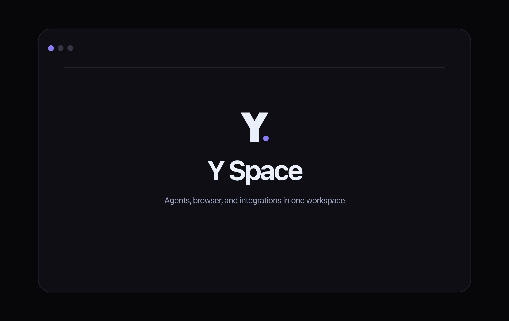

<p align="center">
  
</p>

<h1 align="center">Y Space</h1>

<p align="center">
  <strong>One window for all your AI coding agents.</strong><br />
  Run Claude, Codex, OpenCode, Gemini, Grok, Kimi Code, Qwen Code, Pi, Qoder, Factory Droid, Antigravity, Cursor, Command Code, and Copilot side-by-side. Terminal and chat, any layout — with built-in MCP so agents can orchestrate each other and the app itself.
</p>

<p align="center">
  <a href="https://github.com/zvone187/y-space">Repository</a> · <a href="https://github.com/zvone187/y-space/releases">Download</a> · <a href="https://github.com/zvone187/y-space/issues">Report a Bug</a> · <a href="https://github.com/zvone187/y-space/issues">Request Feature</a>
</p>

<p align="center">
  <em>Bring your own agent subscriptions & API keys</em>
</p>

---

<p align="center">
  
</p>

## Supported Agents

**Claude** · **Codex** · **OpenCode** · **Gemini** · **Grok** · **Kimi Code** · **Qwen Code** · **Pi** · **Qoder** · **Factory Droid** · **Antigravity** · **Cursor** · **Command Code** · **Copilot** and any agent from the [ACP registry](https://agentclientprotocol.com).

## Why Y Space?

If you use more than one AI coding agent, you know the pain: separate terminals, separate apps, no shared context. Y Space puts them all in one place.

### Infinite Threads & Layouts

Mix TUI and GUI agents in any configuration. Open as many threads as you need, arrange them in horizontal and vertical splits, and resize freely. The layout stays fast no matter how many sessions you have running.

### Unified Protocol GUI

A consistent chat interface for ACP and SDK agents — markdown, syntax highlighting, and tool call displays. Where a provider offers more than one runtime (for example Cursor ships CLI, ACP, and SDK), you pick which one a thread runs on.

### Crossagents

Let one agent delegate work to another across providers. Subagent output streams into the parent thread, background runs finish while the parent keeps working, and you can pin routing rules per task type.

### Built-in MCP & App Controls

Y Space ships its own MCP servers. Point any agent at them to create and steer threads, organize projects, list and merge Git worktrees, commit and sync, open and merge pull requests, schedule runs, manage skills, and change settings — or add your own MCP servers over stdio, HTTP, or SSE.

### Agent Experiments

Run one prompt across several agents in parallel worktrees, then let an AI judge compare their code and answers, crown a winner, and merge it or open a PR.

### Scheduled Runs

Put recurring work on a schedule — nightly reviews, dependency sweeps, changelog drafts — and let Y Space start the thread for you.

### Skills & Marketplace

Browse and install skills from public marketplaces, or import your own. One shared folder that every provider picks up automatically.

### On-Device Voice Input

Dictate a prompt with a keystroke. Whisper runs locally, with optional GPU acceleration, so your audio never leaves the machine.

### Checkpoints & Rollback

Rewind a conversation to any earlier message and restore the files with it, with a warning first when another thread shares the same tree.

### Project Workspaces

Group projects into workspaces and switch the whole sidebar between them, so dozens of repos stay one click apart.

### Git Worktrees

Group threads by worktree and drive parallel branches side by side, without leaving the app.

### Live Usage & Limits

See session and weekly quota for every provider — Claude Max, ChatGPT Pro, and more — at a glance.

### Terminal Fidelity

Run CLI agents in real terminal sessions, with the same output and controls you expect from your own shell.

### Built for Speed

Optimized to stay fast and responsive, even when you have lots of agent sessions running side by side.

### Session Persistence

Sessions are saved automatically, so you can close Y Space and pick up right where you left off.

### Built-in Browser

Use a full embedded browser with independent tabs, history, tab groups, screenshots, console and network inspection, and agent automation. Every supported agent receives the same tab inventory and can find, activate, reuse, open, test, and close tabs without controlling an external browser.

### Secure Cookie Import

Pair the import-only companion extension with Chrome, Brave, Edge, or another Chromium browser. Preview domain and cookie counts, choose exactly what to import, and copy authenticated sessions into Y Space's isolated browser partition without exposing cookie values to the renderer or an agent.

### Connections with Pipedream

Use Personal Pipedream MCP or connect selected app accounts through Pipedream Connect. Y Space keeps developer credentials and upstream tokens outside agent processes and exposes enabled integrations through a session-bound local MCP relay.

### Remote Access

Pair the Y Space web app with your desktop to follow live threads, read terminal output, send messages, and receive notifications from your phone or browser.

### Remote Machines over SSH

Connect a server from your SSH config and Y Space installs its runtime there, then runs agents on that machine — clone repos, open threads, and drive projects that never leave the box.

### In-App PRs

Review pull requests, browse diffs, stage changes, and generate AI commits — then let automation watch the PR, fix what fails, merge with your chosen method, and mark the thread done.

### Code Editor

Monaco-based editor with LSP support for quick edits without switching to your IDE.

### Cross-Platform Desktop

Run Y Space on macOS, Windows, and Linux, with a polished interface that feels at home on both Mac and Windows.

### WSL Support

Use Windows and WSL projects side by side, with agent commands routed through the right environment automatically.

### ACP Registry

Install and run any agent from the [Agent Client Protocol](https://agentclientprotocol.com) registry directly from settings.

## Install

Download the latest release for your platform from the [releases page](https://github.com/zvone187/y-space/releases).

| Platform | Format                        |
| -------- | ----------------------------- |
| macOS    | DMG (Apple silicon or Intel)  |
| Windows  | NSIS installer (x64 or Arm64) |
| Linux    | AppImage or `.deb` (x64)      |

### Getting Started

1. Install Y Space for your platform.
2. Install the AI agent CLIs you want to use (e.g., [Claude Code](https://docs.anthropic.com/en/docs/claude-code), [Gemini CLI](https://github.com/google-gemini/gemini-cli), [Codex](https://github.com/openai/codex)).
3. Open Y Space, add your project, and start orchestrating.

### Cookie import

Open **Settings → Browser → Import browser cookies**. The included **Y Space Cookie Import**
extension pairs individual Chrome, Brave, Edge, or Chromium profiles and requests temporary access
only to the exact HTTP(S) origins you approve. Y Space shows a metadata-only preview before the
second confirmation. If an extension cannot be installed, choose a Cookie-Editor JSON or Netscape
cookie file instead; file values stay in the main process and are cleared as soon as the import
finishes or expires.

### Pipedream connections

Personal Pipedream MCP can be added and signed in directly from **Settings → Connections** without
developer credentials. For BYO Pipedream Connect, provide these four variables to the Y Space
process or place them in an ignored `.env.pipedream` file during development:

```text
PIPEDREAM_CLIENT_ID=
PIPEDREAM_CLIENT_SECRET=
PIPEDREAM_PROJECT_ID=
PIPEDREAM_ENVIRONMENT=development
```

For a packaged app launched from a terminal, set `PIPEDREAM_ENV_FILE` to the absolute path of that
file. Y Space captures the credentials before agents start and removes all five variables from their
environment. Connected accounts are exposed to agents only through authenticated loopback MCP
relays.

## Contributing

Contributions are welcome! Please open an [issue](https://github.com/zvone187/y-space/issues) first to discuss what you'd like to change.

## License

[Apache-2.0](LICENSE)
